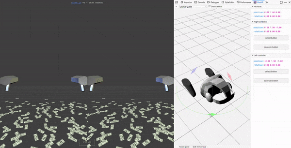
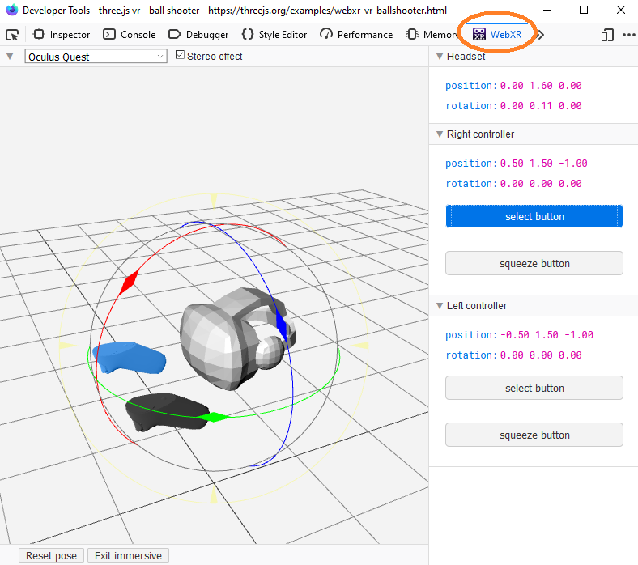

# WebXR emulator extension

WebXR emulator extension is a browser extension which helps your WebXR content creation. It enables to responsively run [WebXR](https://www.w3.org/TR/webxr/) application on your **desktop** browser without the need of any XR devices. 

[Blog post](https://blog.mozvr.com/webxr-emulator-extension/) / [YouTube](https://www.youtube.com/watch?v=Twnzp-LEMkU)



## Features

- [WebXR API polyfill](https://github.com/immersive-web/webxr-polyfill)
- Multiple XR devices emulation
- Graphical device emulator control with [Three.js](https://threejs.org/)
- Cross browsers support with [WebExtensions API](https://developer.mozilla.org/en-US/docs/Mozilla/Add-ons/WebExtensions)
<!-- - [Virtual controller (WIP)](./screenshots/virtual-controller.gif) -->

## Status

- Based on [WebXR device API draft issued on 10 October 2019](https://www.w3.org/TR/webxr/)
- No device specific emulation yet
- Supports only trigger primary button, not other buttons
- Supports only VR, not AR yet

## Browsers

This extension is built on top of [WebExtensions API](https://developer.mozilla.org/en-US/docs/Mozilla/Add-ons/WebExtensions). It works on Firefox, Chrome, and other browsers supporting the API.

## How to use

1. Go to the addon stores to install ([Firefox](https://addons.mozilla.org/firefox/addon/webxr-api-emulator), [Chrome](https://chrome.google.com/webstore/detail/webxr-api-emulator/mjddjgeghkdijejnciaefnkjmkafnnje))

2. Go to WebXR application page (for example, [Three.js examples](https://threejs.org/examples/?q=webvr#webvr_ballshooter)). You will notice that the application detects that you have a XR device (emulated) and it will let you enter the immersive (VR) mode.

3. Open "WebXR" tab in the browser developer tool ([Firefox](https://developer.mozilla.org/en-US/docs/Tools), [Chrome](https://developers.google.com/web/tools/chrome-devtools/)) to controll the emulated devices. You can move the headset and controllers, and trigger the controller buttons. You will see their transforms reflected in the WebXR application.



## Configuration

You can congifure some settings from the top in the WebXR tab.

### Device

You can switch emulated device. The difference between devices is just degrees of freedom and the number of controllers for now.

| Device | Description |
| ---- | ---- |
| None | No device |
| Google Cardboard | 3dof headset and no controller |
| HTC Vive | 6dof headset and two 6dof controllers |
| Oculus Go | 3dof headset and 3dof controller |
| Oculus Quest | 6dof headset and two 6dof controllers |
| Samsung Gear VR | 3dof headset and 3dof controller |

### Stereo Effect

You can enable/disable Stereo Effect which renders two views.

## For development

### How to install the newest version

If you want to develop or debug this extension or if you want to use the under development (not released yet) version, download this repositoy and install the extension into your browser as developer mode. ([Firefox](https://developer.mozilla.org/en-US/docs/Mozilla/Add-ons/WebExtensions/Temporary_Installation_in_Firefox), [Chrome](https://developer.chrome.com/extensions/getstarted))

### How to build polyfill/webxr-polyfill.js

`polyfill/webxr-polyfill.js` is created with npm.

```sh
$ git clone https://github.com/MozillaReality/WebXR-emulator-extension.git
$ cd WebXR-emulator-extension
$ npm install
$ npm run build
```

## Note

- Even if native WebXR API is available the extension overrides it with WebXR polyfill
- (09/11/2019) Currenlty it seems that the extension causes errors on [A-Frame](https://aframe.io/) and it can stop A-Frame applicaiton so that you need to uninstall the extension for it. The root issue seems A-Frame uses old WebXR API while the extension uses the new one. See [#100](https://github.com/MozillaReality/WebXR-emulator-extension/issues/100) and [#81](https://github.com/MozillaReality/WebXR-emulator-extension/issues/81) (Update on 09/18/2019) It seems A-Frame updates their WebXR API in next release [aframe/issues/4268](https://github.com/aframevr/aframe/issues/4268)

## Kudos

Thanks to [WebVR-Extension project](https://github.com/spite/WebVR-Extension), it was a true inspiration for us when building this one.

## License

Mozilla Public License Version 2.0
